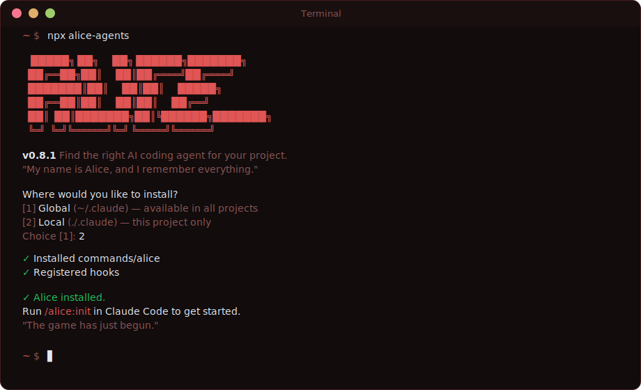

# Alice

**Find the right AI coding agent for your project.**

[](https://www.npmjs.com/package/alice-agents)
[](LICENSE)
[](docs/TESTING.md)

> [!WARNING]
> Alice is in early development. Commands and behaviour may change between releases.

```bash
npx alice-agents
```

Works on Mac, Linux, and Windows.

[What it does](#what-it-does) · [Install](#install) · [Agents](#agents) · [Commands](#commands) · [Contributing](#contributing)

---



Named after the developer's grandmother — with a little inspiration from another Alice who was pretty good at navigating hostile environments.

---

## What it does

- Asks a few questions about how you work and what matters most
- Recommends the right AI coding agent for your project (Clancy, GSD, or PAUL)
- Installs the agent and hands off to its own setup wizard
- Gets out of the way — Alice is a launcher, not an agent

## Who this is for

Developers using Claude Code who want an AI coding agent but aren't sure which one to pick. Alice removes the research step and gets you building faster.

## Agents

Alice knows about three agents. Each has a different philosophy:

| Dimension | Clancy | GSD | PAUL |
| --- | --- | --- | --- |
| **Core model** | Board-driven ticket execution | Spec-driven parallel execution | Mandatory Plan-Apply-Unify loop |
| **Work source** | External boards (Jira, GitHub Issues, Linear) | Local roadmap/phases | Local plans |
| **Board integration** | Yes (3 boards) | None | None |
| **Autonomous mode** | AFK loop — runs through backlog unattended | Manual per-phase | Manual per-plan |
| **Execution model** | Single agent per ticket | Multi-agent parallel waves | Single agent, in-session |
| **Quality approach** | Board review workflow + reviewer role | UAT verification + debug agents | BDD acceptance criteria + mandatory loop closure |
| **Multi-runtime** | Claude Code only | Claude Code, OpenCode, Gemini CLI, Codex | Claude Code only |
| **Ideal for** | Teams with boards, ticket-driven workflow | Fast greenfield builds, parallel execution | Quality-critical projects, audit trails |

> [!TIP]
> [Clancy](https://github.com/Pushedskydiver/clancy) is built by the same developer as Alice. If you're using boards and want autonomous ticket execution, it's the one to try.

## Install

```bash
npx alice-agents
```

You'll be asked whether to install globally (`~/.claude/`) or locally (`.claude/`):

- **Global** — available in all projects
- **Local** — this project only

Non-interactive:

```bash
npx alice-agents --global
npx alice-agents --local
```

## Getting started

After installing, run the wizard in Claude Code:

```
/alice:init
```

Alice will ask 3-4 questions and recommend an agent. Confirm, and she'll install it for you.

## Commands

| Command | Description |
| --- | --- |
| `/alice:init` | Recommend and install the right AI coding agent |
| `/alice:update` | Update Alice to the latest version |
| `/alice:uninstall` | Remove Alice's commands, workflows, and hooks |
| `/alice:help` | List all commands with descriptions |

## How the wizard works

```
/alice:init
    │
    ▼
Detect project state (existing project? agent already installed?)
    │
    ▼
"How do you track work?" → Board → Clancy
                         → No board → "What matters most?"
                                        → Speed → GSD
                                        → Quality → PAUL
    │
    ▼
Show recommendation, confirm, install, hand off
```

## What gets created

```
.claude/
├── commands/
│   └── alice/
│       ├── init.md
│       ├── update.md
│       ├── uninstall.md
│       └── help.md
└── alice/
    └── workflows/
        ├── init.md
        ├── uninstall.md
        ├── handoff-clancy.md
        ├── handoff-gsd.md
        └── handoff-paul.md
```

## Credits

Alice stands on the shoulders of some brilliant people:

- **Geoffrey Huntley** — coined the [Ralph technique](https://ghuntley.com/ralph/) that powers Clancy
- **TACHES** — built [GSD (Get Shit Done)](https://github.com/glittercowboy/get-shit-done), the speed-first parallel agent
- **Christopher Kahler** — built [PAUL](https://github.com/ChristopherKahler/paul), the quality-first Plan-Apply-Unify framework

See [CREDITS.md](CREDITS.md) for full acknowledgements.

## Security

See [SECURITY.md](SECURITY.md) for vulnerability reporting policy.

## Contributing

See [CONTRIBUTING.md](CONTRIBUTING.md) for how to contribute. The primary contribution surface is `registry/agents.json`.

## License

[MIT](LICENSE)
